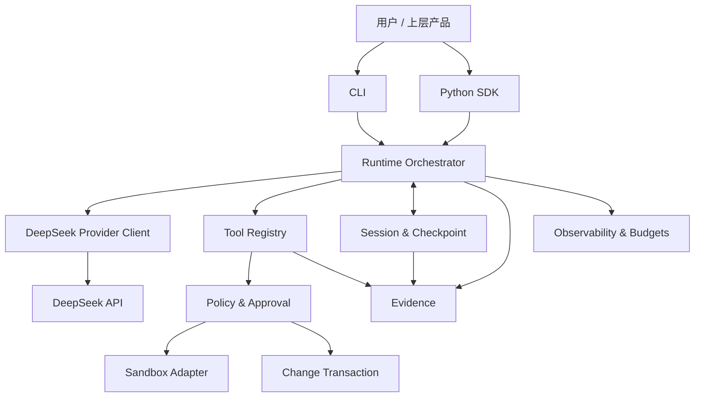
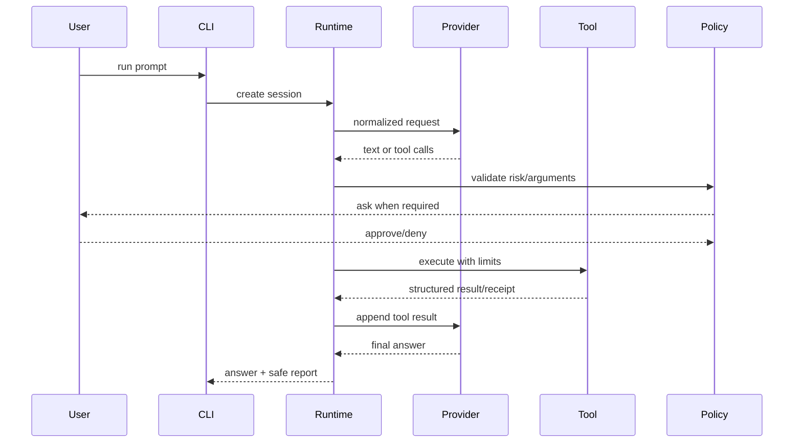

# DeepSeek Runtime 产品架构

> 状态：Target Alpha Architecture
> 基线：`develop@0e1e435`
> 产品原则：少加功能，优先把本地 Agent Runtime 的基本承诺做真。

## 1. 产品定义

DeepSeek Runtime 是一个面向开发者的、DeepSeek-native、local-first Python Runtime Kernel。

它不直接提供完整 IDE、桌面应用或托管 Agent 平台，而是提供构建这些上层产品时必须复用的执行基础：

- Provider 通信；
- 多步 Agent Loop；
- 工具注册和执行；
- 权限与审批；
- 会话和恢复；
- 文件变更与回滚；
- 安全证据；
- 用量、缓存、成本和诊断；
- 发布验证。

一句话产品价值：

> 让开发者不必从零实现 Agent 的执行生命周期，同时明确本地权限、状态、证据和失败恢复的边界。

## 2. 产品边界

### In Scope

1. Python SDK。
2. 本地 CLI。
3. 单用户、单机、local-first。
4. DeepSeek 官方 API 的主要 Agent 交互能力。
5. 可信宿主中的工具编排。
6. 可插拔的 OS/container sandbox adapter。
7. 本地 checkpoint。
8. 默认脱敏的证据和诊断。
9. 可复现测试和发布门禁。

### Out of Scope

1. 完整终端 UI、IDE 或桌面产品。
2. 云端多租户控制平面。
3. 用户账号、计费、团队管理。
4. 通用工作流编排平台。
5. 模型训练或推理服务。
6. 以内建黑名单替代 OS 安全隔离。
7. 保证任意外部工具 exactly-once。
8. 远程 MCP 市场或插件商店。
9. 大规模长期记忆和向量数据库。

## 3. 用户角色

| 角色 | 核心任务 | 成功标准 |
| --- | --- | --- |
| Runtime 集成开发者 | 把 DeepSeek Agent 能力接入自己的应用 | 少量代码获得可控工具循环和结构化结果 |
| Tool 开发者 | 注册文件、命令或业务工具 | Schema 明确、权限明确、错误可恢复 |
| 本地最终用户 | 在自己的工作区运行任务 | 知道 Agent 做了什么、能否批准、能否恢复 |
| 安全审查者 | 判断 Runtime 是否越权或泄密 | 有明确威胁模型、证据和对抗测试 |
| 开源贡献者 | 修复问题、扩展 Provider/Tool | 开发环境简单，CI 反馈确定 |
| Maintainer | 发布版本和管理兼容性 | 有单一 PRD、质量门禁和可复现构件 |

## 4. Jobs To Be Done

### JTBD-01：从 API 调用升级为 Agent Loop

当开发者已有 DeepSeek API Key 时，希望用一个稳定的 Runtime 完成“模型请求—工具调用—工具结果—最终回答”，而不是自己处理每一种协议边界。

### JTBD-02：给工具调用加不可绕过的治理

当模型要执行工具时，开发者希望 Runtime 自动验证参数、风险、权限、审批、超时和输出预算。

### JTBD-03：任务中断后安全恢复

当进程或网络中断时，用户希望恢复上下文，并明确哪些副作用已经完成、哪些状态不确定，避免盲目重复执行。

### JTBD-04：生成可分享但不泄密的证据

当需要排查或发布验证时，维护者希望输出结构化证据，而不是完整 prompt、response、API Key 或 reasoning 文本。

### JTBD-05：判断成本和缓存是否合理

当 Agent 执行多个步骤时，开发者希望看到调用次数、Token、缓存命中、成本、延迟和成功率，并能设置预算。

## 5. 产品能力架构

## 6. 产品层级

### L0：入口层

- Python SDK；
- `deepseek-runtime doctor`；
- `deepseek-runtime run`；
- 机器可读 JSON 模式。

### L1：Runtime Orchestration

负责：

- step loop；
- Provider response normalization；
- tool dispatch；
- stop conditions；
- retry/cancellation；
- context/cost/step budget；
- lifecycle hooks。

### L2：Tool Contract

每个工具必须声明：

- name；
- description；
- JSON Schema；
- handler；
- risk；
- side-effect；
- timeout；
- output limit；
- recovery/idempotency policy。

### L3：Governance

- default-deny；
- allow/ask/deny；
- 用户审批；
- 路径和命令策略；
- sandbox adapter；
- audit trail。

### L4：State & Recovery

- recoverable checkpoint；
- tool call state machine；
- execution receipt；
- uncertain side-effect state；
- schema migration；
- local encryption option。

### L5：Evidence & Observability

- request/response structural evidence；
- content summary；
- redaction；
- latency；
- token/cache/cost；
- budgets；
- diagnostics；
- release evidence。

## 7. 核心用户流程

### 7.1 本地运行

### 7.2 中断恢复

1. Runtime 在 Provider 请求前、工具执行前、工具执行后保存 checkpoint。
2. 恢复时加载 schema-compatible checkpoint。
3. `succeeded` 跳过。
4. `pending` 可执行。
5. `running` 进入 uncertain 状态，不能默认重复副作用。
6. 根据 Tool recovery policy：查询 receipt、人工确认或幂等重试。
7. 恢复完整 Provider 对话语义后继续。

## 8. 产品状态矩阵

| 能力 | 当前 | Open-source Alpha 目标 |
| --- | --- | --- |
| Provider Client | Implemented/Partial | 响应规范化、重试、流式增量 API |
| Runtime Loop | Implemented/Partial | 接入 registry、policy、session、budget |
| Tool Schema | Partial | 正式 ToolSpec + JSON Schema validation |
| Built-in Workspace Tools | Implemented/Blocked | 修复 symlink、资源预算和错误语义 |
| Permission Policy | Implemented/Partial | 明确 first/last match，接入 approval |
| Command Execution | Partial | 定位为 Gate + 可插拔 sandbox adapter |
| Change Manager | Implemented/Blocked | 不可伪造 rollback、锁和冲突安全 |
| Session Store | Implemented/Blocked | checkpoint/evidence 分离、加密选项 |
| Resume | Partial/Blocked | uncertain side-effect recovery |
| Evidence | Implemented/Partial | canonical identity、隐私等级 |
| Observability | Implemented/Partial | 完整输入成本和 runtime budget |
| CLI | Implemented/Partial | 默认返回答案，报告单独输出 |
| CI/Release | Partial | 多平台 CI、secret scan、reproducible build |

## 9. 产品原则

1. **不可绕过优先于功能丰富。**
2. **恢复状态与公开证据分离。**
3. **默认安全，但不制造虚假安全感。**
4. **模型行为不可信；工具输入必须验证。**
5. **任何副作用都必须有明确恢复语义。**
6. **未知成本不是零成本。**
7. **README 不承诺未通过验收的能力。**
8. **开源的第一目标是可理解、可运行、可贡献、可验证。**

## 10. 产品成功指标

Open-source Alpha 不追求用户量，追求可信度：

- P0/P1 未关闭数：0；
- CI 支持 Python 3.11–3.13、Linux/macOS/Windows；
- 核心测试通过率：100%；
- 安全对抗测试通过率：100%；
- 文档示例可执行率：100%；
- 首次安装到 `doctor` 成功时间：≤ 5 分钟；
- 不需要真实 API 的测试比例：≥ 95%；
- 发布构件可复现；
- README 能力均有 PRD ID 和自动化验收证据。
