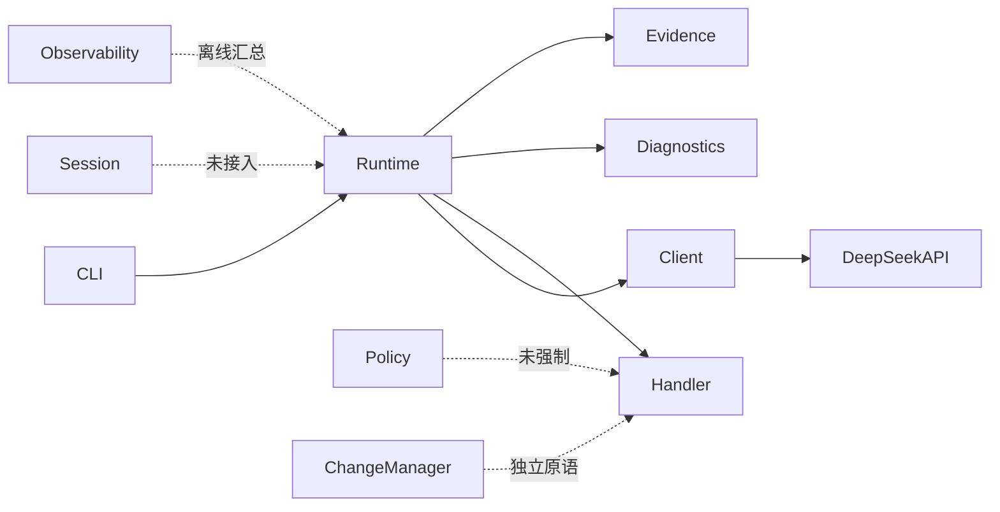
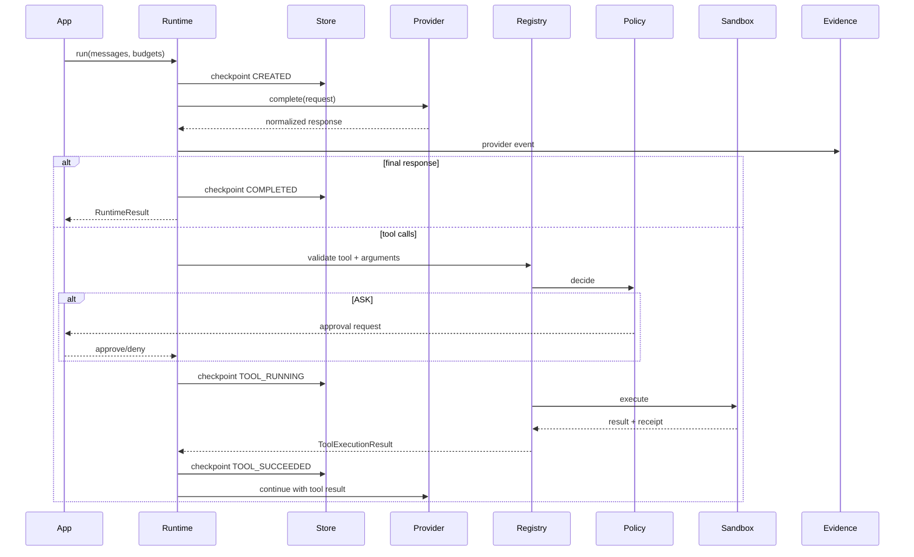

# DeepSeek Runtime 技术架构

> 状态：Current + Target Architecture
> 基线：`develop@0e1e435`
> 目标：以最少重构建立可测试、不可绕过的 Runtime 生命周期。

## 1. 当前模块

| 模块 | 当前职责 | 主要风险 |
| --- | --- | --- |
| `client.py` | HTTP、SSE、ProviderResult、配置 | 响应 shape、重试、真流式不足 |
| `runtime.py` | ReAct loop、内建只读工具 | 未接入 session/security；symlink 风险 |
| `session.py` | 状态、文件存储、恢复 | checkpoint/evidence 混合；副作用重复 |
| `security.py` | policy、路径、命令、changeset | 不是隔离；rollback token 可伪造 |
| `evidence.py` | hash、redact、结构证据 | canonical/隐私和任意输入健壮性 |
| `observability.py` | 使用量、成本、成功率 | 未知成本按 0、数据质量语义混合 |
| `diagnostics.py` | 环境和 evidence 摘要 | env 注入 bug、检查不等于可运行 |
| `cli.py` | doctor/run | 默认不显示最终回答 |
| `scripts/*` | 演练、构件、门禁 | denylist 打包、SHA 只验长度 |
| `tests/*` | 15 个基础测试 | 缺少系统、对抗、恢复和协议测试 |

## 2. 当前运行路径



## 3. 目标组件模型

### 3.1 Provider Adapter

```python
class ProviderAdapter(Protocol):
    def complete(self, request: ProviderRequest) -> ProviderResponse: ...
    def stream(self, request: ProviderRequest) -> Iterator[ProviderEvent]: ...
```

职责：

- 生成请求；
- 统一响应 shape；
- 错误分类；
- retry/backoff；
- request id；
- provider protocol compatibility；
- 不承担业务工具执行。

### 3.2 ToolSpec / ToolRegistry

```python
@dataclass(frozen=True)
class ToolSpec:
    name: str
    description: str
    parameters: dict[str, Any]
    handler: ToolHandler
    risk: Risk
    side_effect: bool
    timeout_seconds: float
    max_output_bytes: int
    recovery_policy: RecoveryPolicy
```

Registry 必须：

- 拒绝重复名称；
- 校验 JSON Schema；
- 生成 Provider tools definition；
- 统一执行包装；
- 输出 ToolExecutionResult；
- 不允许 Runtime 直接调用裸 handler。

### 3.3 Runtime Orchestrator

Runtime 只负责状态机：

```text
CREATED
  → PROVIDER_PENDING
  → PROVIDER_COMPLETED
  → TOOL_REQUESTED
  → APPROVAL_PENDING?
  → TOOL_RUNNING
  → TOOL_SUCCEEDED | TOOL_FAILED | TOOL_UNCERTAIN
  → PROVIDER_PENDING
  → COMPLETED | FAILED | CANCELLED | BUDGET_EXCEEDED
```

所有状态转换必须发出 lifecycle event 并可 checkpoint。

### 3.4 Policy & Approval

策略输入：

- tool name；
- risk；
- normalized path；
- normalized command；
- side-effect；
- session/user context。

输出：

- ALLOW；
- ASK；
- DENY；
- reason/code；
- optional constraints。

ASK 必须有显式 ApprovalProvider，不能等价于 deny，也不能静默 allow。

### 3.5 Sandbox Adapter

```python
class SandboxAdapter(Protocol):
    def execute(self, spec: ExecutionSpec) -> ExecutionResult: ...
```

实现层级：

1. `NoIsolationLocalAdapter`：仅可信开发环境；
2. `RestrictedSubprocessAdapter`：最小 env、timeout、cwd、rlimit；
3. Docker/Podman adapter；
4. 平台特定 sandbox adapter。

必须在文档中标注每个 adapter 的安全保证，不用命令黑名单伪装隔离。

### 3.6 Checkpoint Store

两种数据模型：

```text
RecoverableCheckpoint
- complete conversation state
- provider continuation fields
- tool call states
- receipts
- approvals
- budgets
- optionally encrypted at rest

PublishableEvidence
- hashes/length/schema
- redacted metadata
- no recoverable secret content
```

必须支持：

- schema version；
- migration；
- atomic single-checkpoint write；
- directory fsync；
- optional file lock；
- corruption detection；
- local encryption key injection。

### 3.7 Change Transaction

目标语义：

- validate all；
- reject duplicate path；
- lock workspace；
- stage files；
- preserve metadata；
- compare current version before commit；
- replace；
- fsync files and directories；
- produce opaque rollback handle；
- rollback checks post-change version；
- emit evidence。

跨多个目录的严格原子性无法由普通文件系统保证时，必须明确为 best-effort。

## 4. 目标数据流



## 5. 信任边界

| 边界 | 默认信任 | 必须防御 |
| --- | --- | --- |
| 模型输出 | 不可信 | 工具名、JSON、路径、命令、超长输出 |
| 用户 prompt | 敏感但合法 | 日志泄漏、注入到 shell |
| Tool handler | 半可信 | 超时、异常、外部副作用、非幂等 |
| 工作区文件 | 不可信 | symlink、二进制、巨型文件、权限 |
| Provider response | 不可信 | 任意 JSON shape、协议漂移 |
| Checkpoint storage | 本地主机可访问 | 明文敏感内容、篡改、损坏 |
| Release working tree | 不可信 | `.env`、未跟踪 secret、构建污染 |

## 6. 错误分类

统一错误码至少包括：

- `CONFIG_INVALID`
- `PROVIDER_AUTH`
- `PROVIDER_RATE_LIMIT`
- `PROVIDER_TIMEOUT`
- `PROVIDER_TRANSPORT`
- `PROVIDER_MALFORMED_RESPONSE`
- `TOOL_NOT_FOUND`
- `TOOL_ARGUMENT_INVALID`
- `TOOL_PERMISSION_DENIED`
- `TOOL_APPROVAL_REQUIRED`
- `TOOL_TIMEOUT`
- `TOOL_EXECUTION_FAILED`
- `TOOL_RESULT_INVALID`
- `TOOL_SIDE_EFFECT_UNCERTAIN`
- `CHECKPOINT_CORRUPT`
- `CHECKPOINT_VERSION_UNSUPPORTED`
- `BUDGET_STEP_EXCEEDED`
- `BUDGET_TOKEN_EXCEEDED`
- `BUDGET_COST_EXCEEDED`
- `CANCELLED`
- `SANDBOX_VIOLATION`
- `CHANGE_CONFLICT`
- `ROLLBACK_CONFLICT`

错误必须包含 machine-readable code，禁止上层依赖英文异常字符串。

## 7. Provider 与流式协议

### 非流式

1. 限制最大响应体；
2. JSON 根必须 normalize 为对象；
3. 校验 choices/message/tool_calls；
4. 保留原始 request id；
5. 429/5xx 支持可配置退避；
6. 非幂等 tool side effect 不由 Provider retry 触发。

### 流式

需要真正的增量 parser：

- 支持任意 byte chunk boundary；
- 增量 UTF-8 decoder；
- SSE event framing；
- multiline `data:`；
- `[DONE]`；
- malformed event error evidence；
- consumer callback/iterator；
- cancellation；
- accumulated final response；
- usage event reconciliation。

## 8. Evidence 设计

Evidence ID 建议基于 canonical envelope：

```json
{
  "method": "POST",
  "endpoint": "/chat/completions",
  "body": "<canonical-json>",
  "provider": "deepseek"
}
```

隐私等级：

- `PUBLIC`: 无正文，仅结构；
- `LOCAL_SAFE`: 可包含受控摘要；
- `LOCAL_DEBUG`: 明文，显式开启；
- `CHECKPOINT_SECRET`: 可恢复，加密存储，不进入日志。

对于低熵敏感文本，不应把裸 SHA-256 视为匿名化；可使用 keyed HMAC 或不输出 hash。

## 9. 非功能要求

| 类别 | 要求 |
| --- | --- |
| 兼容性 | Python 3.11–3.13；Linux/macOS/Windows |
| 稳定性 | 核心 API 有版本化和弃用策略 |
| 安全 | P0/P1 对抗测试必须自动化 |
| 性能 | 内建 search 和输出必须有资源预算 |
| 可恢复性 | 任何副作用都有明确 recovery policy |
| 可观测性 | step/provider/tool/checkpoint 都产生事件 |
| 隐私 | 默认日志不含 prompt/response/reasoning/key |
| 可测试性 | Provider、approval、clock、filesystem 可注入 |
| 发布 | wheel/sdist、hash、SBOM/依赖清单、secret scan |
| 文档 | 每个公开 API 有最小可运行示例 |

## 10. 建议 ADR

- ADR-001：Runtime 是 local-first kernel，不做 hosted control plane。
- ADR-002：Checkpoint 与 Evidence 分离。
- ADR-003：Command gate 不等于 sandbox。
- ADR-004：ToolSpec 是所有工具调用的唯一入口。
- ADR-005：Side-effect recovery 不承诺通用 exactly-once。
- ADR-006：未知用量和成本保持 unknown，不转换为 0。
- ADR-007：公开输出默认 content-free。
- ADR-008：PRD 与测试用例 ID 是发布门禁输入。
